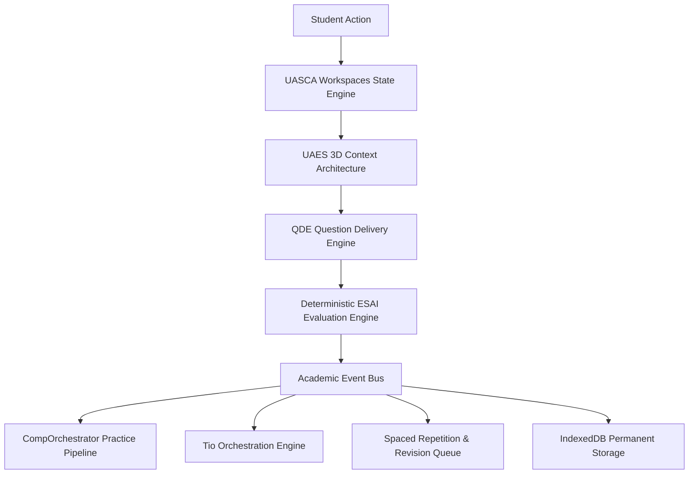

# 🚀 Mentorix AI Learning Ecosystem (v2.4)
> The authoritative, curriculum-first AI learning platform & competitive exam ecosystem built for JEE Main, JEE Advanced, and NEET UG test simulations. Free forever for under-resourced students.

---

## 🏛️ Ecosystem Architecture
Mentorix is built on a highly modular, decoupled architecture where every subsystem owns exactly one responsibility. Academic logic, AI coaching, design systems, adaptive layouts, and state continuity remain strictly isolated and event-driven.



---

## 📂 System Modules & Architecture

| Module | Location | Responsibility |
| :--- | :--- | :--- |
| **UASCA Engine** | [`src/js/services/uascaEngine.js`](file:///c:/Users/Harsha/.gemini/antigravity-ide/scratch/mentorix/src/js/services/uascaEngine.js) | 4-Level state classification (UI, Session, Learning, Identity) & 4 isolated Workspaces (`Learning`, `Comp`, `Tio`, `Profile`). |
| **UAES Engine** | [`src/js/services/uaesEngine.js`](file:///c:/Users/Harsha/.gemini/antigravity-ide/scratch/mentorix/src/js/services/uaesEngine.js) | Reshapes interface across 3 simultaneous dimensions: Device Personas, User Context, and Activity Context. |
| **Tio Orchestrator** | [`src/js/services/tioOrchestrator.js`](file:///c:/Users/Harsha/.gemini/antigravity-ide/scratch/mentorix/src/js/services/tioOrchestrator.js) | Central AI companion layer with 6 context modes & high-focus exam suppression. |
| **Comp Orchestrator** | [`src/js/services/compOrchestrator.js`](file:///c:/Users/Harsha/.gemini/antigravity-ide/scratch/mentorix/src/js/services/compOrchestrator.js) | End-to-end exam practice orchestrator connecting QDE, ESAI, and Mastery Engine. |
| **Universal Navigation** | [`src/js/router.js`](file:///c:/Users/Harsha/.gemini/antigravity-ide/scratch/mentorix/src/js/router.js) | Canonical route single source of truth, hash URL deep-linking, and scroll preservation. |
| **Universal Design System** | [`src/index.css`](file:///c:/Users/Harsha/.gemini/antigravity-ide/scratch/mentorix/src/index.css) | Standardized intent palette (`--uds-cyan`, `--uds-green`, `--uds-gold`, `--uds-red`, `--uds-purple`), motion budgets, and touch targets. |

---

## 🎯 6-Level Curriculum Hierarchy
Every question is strictly bound to our curriculum-first hierarchy:

```
[Level 1: Exam]       JEE Main / JEE Advanced / NEET UG
       ↓
[Level 2: Subject]    Physics / Chemistry / Mathematics
       ↓
[Level 3: Chapter]    Electrostatics / Complex Numbers
       ↓
[Level 4: Topic]      Coulomb's Law / Euler Form
       ↓
[Level 5: Subtopic]   Coulomb's Law Detailed
       ↓
[Level 6: Concept]    Coulomb Forces (Leaf nodes mapping questions)
```

---

## 🛠️ Verification & Test Suite Execution
We maintain an automated verification toolkit to certify every module and state transition:

```bash
# Execute Ultimate Codebase & UX System Audit
node scratch/ultimate_codebase_audit.js

# Individual Phase Verification Scripts
node scratch/phase19_verification.js   # UASCA 4-Level State & Workspaces
node scratch/phase18_verification.js   # UAES 3D Context & Personas
node scratch/phase17_verification.js   # Universal Device Compatibility
node scratch/phase16_verification.js   # Universal Navigation & IA
node scratch/phase15_verification.js   # Tio Orchestration Engine
node scratch/phase14_verification.js   # Universal Design System (UDS)
node scratch/full_codebase_audit.js    # Deep 37-Module VM Execution Audit
node scratch/regression_test.js        # E2E Navigation Simulation
```

---

## 🗺️ Completed Milestones
- [x] **Phase 1: Core Foundation & Domain Models**
- [x] **Phase 2: Academic Registry & Curriculum Intelligence**
- [x] **Phase 3: Question Repository & Question Intelligence System (QRIS)**
- [x] **Phase 4: Evaluation, Scoring & Attempt Intelligence Engine (ESAI)**
- [x] **Phase 5: Practice Engine & Adaptive Session Generator**
- [x] **Phase 6: CBT Simulation Engine & Official Exam Blueprinting**
- [x] **Phase 7: Spaced Repetition & Revision Engine (QRAReviewEngine)**
- [x] **Phase 8: Analytics & Dashboard Telemetry**
- [x] **Phase 9: Tio AI Coach Integration & Event Bus Dispatches**
- [x] **Phase 10: Full Application SPA Modularization**
- [x] **Phase 11: Production Deploy Sync & IndexedDB Storage System**
- [x] **Phase 12: Targeted Practice & Mistake Diary Integration**
- [x] **Phase 13: Question Delivery Engine (QDE) & KaTeX Pre-rendering**
- [x] **Phase 14: Universal Design System (UDS) & Token Intent Palette**
- [x] **Phase 15: Tio Orchestration Layer & Contextual AI Companion Engine**
- [x] **Phase 16: Universal Navigation & Information Architecture (IA)**
- [x] **Phase 17: Universal Device Compatibility & Hardware Scaling Engine**
- [x] **Phase 18: Universal Adaptive Experience System (UAES) & 3D Context Architecture**
- [x] **Phase 19: Universal Application State & Continuity Architecture (UASCA) & Workspaces**

---

> [!IMPORTANT]
> **Pedagogical Rule #1:** AI should never decide whether a student answer is correct or incorrect. Correctness is evaluated deterministically by the official verification engine, while AI is utilized later to explain the underlying logic.
