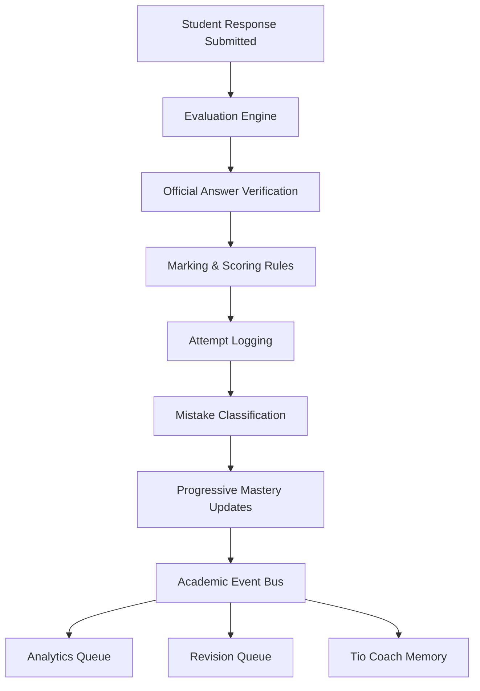

# 🚀 Mentorix Competitive Exams v2 (CEE)
> The authoritative, curriculum-first engine powering JEE Main, JEE Advanced, and NEET UG test simulations inside the Mentorix adaptive AI ecosystem.

---

## 🏛️ Competitive Exams Architecture (CEE)
Mentorix CEE is built on a highly modular, decoupled architecture where every subsystem owns exactly one responsibility. The core operating system coordinates student practice, CBT simulations, scoring, and telemetry updates.



---

## 📂 Core Subsystems & Folder Registry
Every module resides under `src/modules/competitive-exams/` and implements the exact subsystem interfaces without duplication:

| Subsystem Component | Registry Path | Responsibility |
| :--- | :--- | :--- |
| **Academic Registry** | [`core/academic-registry/`](file:///C:/Users/Harsha/.gemini/antigravity-ide/scratch/mentorix/src/modules/competitive-exams/core/academic-registry/) | Single source of truth for the 6-level syllabus tree, paper specs, and prerequisites. |
| **Question Repository (QRIS)** | [`core/question-repository/`](file:///C:/Users/Harsha/.gemini/antigravity-ide/scratch/mentorix/src/modules/competitive-exams/core/question-repository/) | Canonical model ingestion, multi-dimensional search indexing, and 9-stage lifecycle checks. |
| **Event Bus** | [`core/event-bus/`](file:///C:/Users/Harsha/.gemini/antigravity-ide/scratch/mentorix/src/modules/competitive-exams/core/event-bus/) | Decoupled publisher-subscriber channel dispatches to downstream systems. |
| **Core Shared Engine** | [`core/shared/`](file:///C:/Users/Harsha/.gemini/antigravity-ide/scratch/mentorix/src/modules/competitive-exams/core/shared/) | Houses state machines, domain schemas, config specifications, and interface contracts. |

---

## 🎯 CEE 6-Level Syllabus Hierarchy
Every competitive question is strictly bound to our curriculum-first hierarchy. Nothing skips levels:

```
[Level 1: Exam]       JEE Main / NEET UG
       ↓
[Level 2: Subject]    Physics / Chemistry / Mathematics
       ↓
[Level 3: Chapter]    Electrostatics / complex Numbers
       ↓
[Level 4: Topic]      Coulomb's Law / Euler Form
       ↓
[Level 5: Subtopic]   Coulomb's Law Detailed
       ↓
[Level 6: Concept]    Coulomb Forces (Leaf nodes mapping questions)
```

---

## ⚙️ Ingestion & Invariant Validations
Every question ingested into QRIS must pass sequential 9-stage lifecycles and validation assertions before reaching `Published` state:

```
Imported ➔ Parsed ➔ Normalized ➔ Classified ➔ Validated ➔ Verified ➔ Indexed ➔ Published ➔ Archived
```

* **Formula Balances:** Audits balanced KaTeX math delimiters (`$` or `$$`).
* **HTML Struct Audits:** Verifies all HTML tags (`<div>`, `<span>`, `<p>`) are closed.
* **Asset Alt Tags:** Requires alt properties for diagram and image assets.
* **Syllabus Bounds:** Confirms chapter and topic nodes exist inside the Academic Registry.

---

## 🛠️ Verification & Test Suite Execution
We maintain a robust validation toolkit to certify every engine transition, scoring scheme, and metadata query:

```bash
# Execute Phase-specific validation checks
node scratch/verify_foundation.js         # Core Foundation state transitions
node scratch/verify_academic_registry.js   # 6-Level syllabus and prerequisite graphs
node scratch/verify_qris.js                # Ingestion lifecycles, searches, and version logs
node scratch/verify_ail.js                 # Academic Intelligence query tools
node scratch/verify_sge.js                 # Session Generation blueprint blueprints
node scratch/verify_qde.js                 # Examination countdowns and recovery
node scratch/verify_esai.js                # Pipeline events, scoring, and mistakes classification
```

---

## 🗺️ Roadmap & Progress Registry
- [x] **Phase 1: Core Foundation (Architecture & Domain Models)**
- [x] **Phase 2: Academic Registry & Curriculum Intelligence**
- [x] **Phase 3: Question Repository & Question Intelligence System (QRIS)**
- [x] **Phase 4: Evaluation, Scoring & Attempt Intelligence Engine (ESAI)**
- [ ] **Phase 5: Practice Engine** *(Ready to Start)*
- [ ] **Phase 6: CBT Simulation Engine** *(Suggested)*
- [ ] **Phase 7: Spaced Repetition & Revision Engine** *(Suggested)*
- [ ] **Phase 8: Analytics & Dashboard telemetry** *(Suggested)*
- [ ] **Phase 9: Tio AI Coach integration** *(Suggested)*

---

> [!IMPORTANT]
> **Pedagogical Rule #1:** AI should never decide whether a student answer is correct or incorrect. Correctness is evaluated deterministically by the official verification engine, while AI is utilized later to explain the underlying logic.
